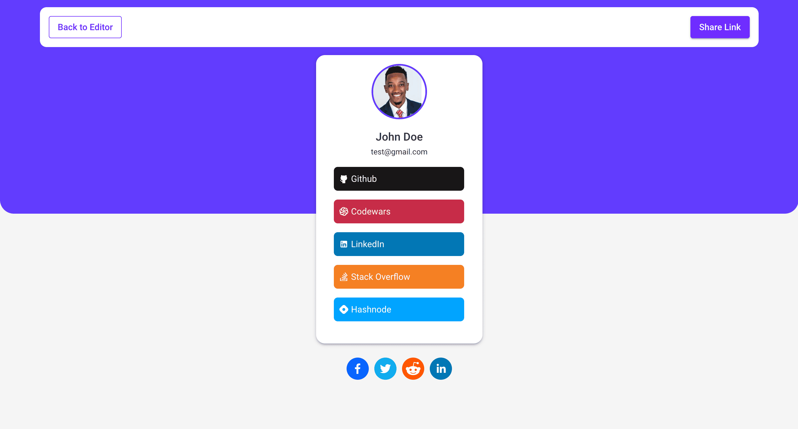

# DevLinks App

## Overview

In this project, you'll build a fully-functional DevLinks app for developers! You'll practice working with image uploads, repeater fields, drag-and-drop, and more!

## Technologies Used

- **React**: A JavaScript library for building user interfaces.
- **TypeScript**: A superset of JavaScript that adds static types.
- **Material UI**: A popular React UI framework for styling components.
- **Storybook**: A tool for developing UI components in isolation.
- **Jest**: A testing framework for JavaScript.

## Pages

- Home page

  

- Login page

  

- Register page

  

- Links page

  

- Profile page

  

- Preview page

  

- Details page

  

- Not Found page

  

## Getting Started

### Prerequisites

- Node.js
- npm or yarn

### Environment Variables

- **VITE_API_URL**: The base URL for the API used in the application. Set this in your `.env` file.

### Installation

1. Clone the repository:
   ```bash
   git clone https://github.com/devlinks2000/frontend
   ```
2. Navigate to the project directory:
   ```bash
   cd frontend
   ```
3. Install dependencies:
   ```bash
   npm install
   # or
   yarn install
   ```

### Running the App

To start the development server, run:

```bash
npm start
# or
yarn start
```

### Running Storybook

To start Storybook, run:

```bash
npm run storybook
# or
yarn storybook
```
